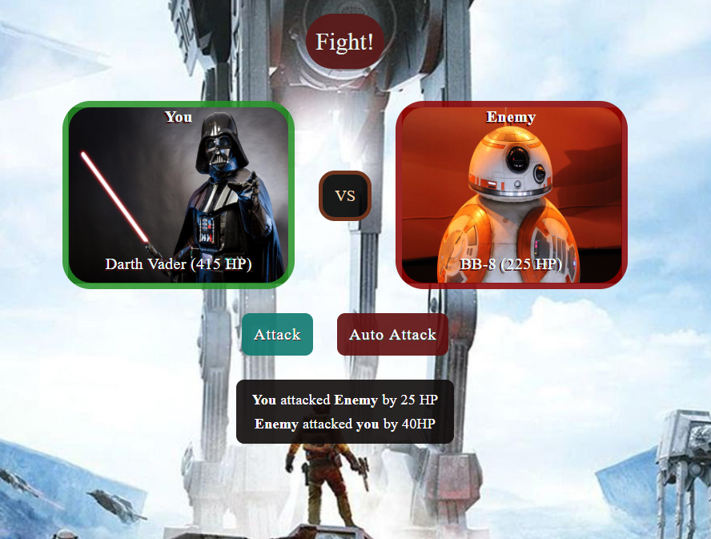

# Star Wars RPG Game

## Overview:
This application is a Star Wars RPG game, the player will choose a character by clicking on the fighter's picture. The player will fight as that character for the rest of the game.

## Project Dependencies:
This app requires to include this CDN library: `jquery`.

## Basic Usage:

* The app runs by opening the `index.html` in the web-browser, then the user can start the game by choosing one character from the list, and then choose the opponent character to start the match.

* If the player's character wins the match, the user is prompted to choose another character to move to the next match.

* If the player's caracter loses any match, the game will restart.

* If all oppenent characters are defeated, the player wins the game.

## Screenshot of Usage:
  

## Try it:

This [link](https://ibsafi.github.io/Star-Wars-Game/) will jump you to test the application, have fun!